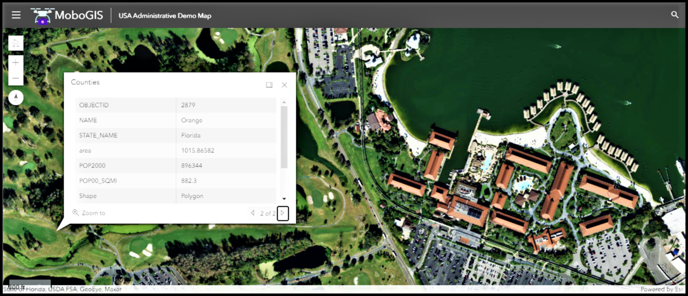
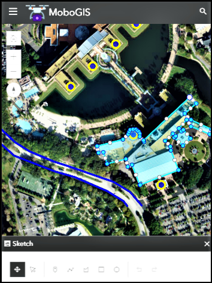
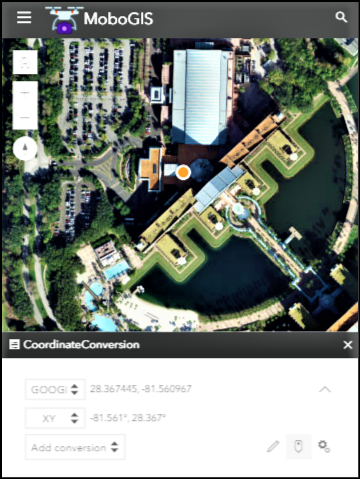

Introduction
------------

[MoboGIS ](https://rawcdn.githack.com/MohammadNasim/AcrGIS-JS-GISMapViewer/596977a6dcd9673ea1e97fade00a980432993bed/mapCore2D.html)is
an open source mapping framework. MoboGIS works with the [Esri
JavaScript
API](https://developers.arcgis.com/javascript/jsapi/3/), [ArcGIS
Server](https://www.esri.com/software/arcgis/arcgisserver), [Calcite
Maps](https://github.com/esri/calcite-maps/), [ArcGIS
Online](https://arcgis.com/) and more.

About
-----

MoboGIS - The Editable Map Viewer -- is a open source mapping framework
built on the Esri JavaScript API and the Dojo Toolkit

Make It Your Own!
-----------------

This JavaScript web app can be easily editable or used as a starting
point. It also demonstrates best practices for modular design and OOP
via classes in JS using dojo\'s
great [dojotoolkit](https://dojotoolkit.org/reference-guide/1.9/dojo/_base/declare.html) system.

Try The Demo:
-------------

[https://rawcdn.githack.com/MohammadNasim/AcrGIS-JS-GISMapViewer/596977a6dcd9673ea1e97fade00a980432993bed/mapCore2D.html](https://rawcdn.githack.com/MohammadNasim/AcrGIS-JS-GISMapViewer/596977a6dcd9673ea1e97fade00a980432993bed/mapCore2D.html)

**Functions Included inside the framework:**

1.  Find Places

2.  About

3.  Base-maps Gallery

4.  Legend

5.  Layer Control

6.  Identify

7.  Draw

8.  Feature Spatial Editing

9.  Measure

10. Coordinate Search

11. Print

12. Bookmarks

13. Home

14. Locate Button (Geolocation)

15. North Arrow

16. Scale bar

17. Navigate Map

MoboGIS-calcite-maps
====================

This repo
combines [MoboGIS](https://github.com/MohammadNasim/AcrGIS-JS-GISMapViewer) with
Esri\'s [Calcite Maps](https://github.com/esri/calcite-maps/). Calcite
Maps is \"A theme for [Bootstrap](https://www.getbootstrap.com/) for
designing, styling and creating modern map apps.\" The Esri repository
provides documentation on the Calcite Maps CSS and JavaScript files.

There are very few changes needed to use Calcite Maps. The majority of
the customizations are within the HTML page and JS file [Styler
file ](https://github.com/MohammadNasim/AcrGIS-JS-GISMapViewer/blob/master/js/webConfig.js).

One typical example to show the Measurement Widget capabilities.

Another example that is 'Print' widget shown in the picture below.

Print (Output)
--------------

Mobile
------

One of the strengths of using Calcite Maps is the responsive design
provided by the Bootstrap framework.

